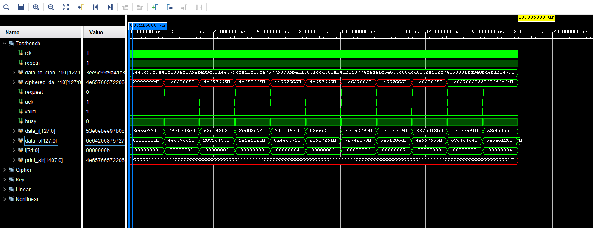

# Data encryption with "Kuznechik" algorithm

### Description

Project of 128 bit data blocks encryption with SystemVerilog for hardware devices. Using "Kuznechik" code, which standart is declared in Russian Federation GOST [P 34. 12-2015](https://protect.gost.ru/v.aspx?control=8&baseC=-1&page=0&month=-1&year=-1&search=&RegNum=1&DocOnPageCount=15&id=193095)

### Results

Accomplished realizations time expences:

- 1 clock for the XOR operation
- 1 clock for the nonlinear operation
- 16 clocks for the linear operation

Beaware that in this study project the memory, transition and etc. delays were not taken into account. 

18,380 clocks for the encryption of the following data:

|              Input data               |     Encrypted data      |
| :-----------------------------------: | :---------------------: |
| 128'h3ee5c99f9a41c389ac17b4fe99c72ae4 |    Never gonna give     |
| 128'h79cfed3c39fa7677b970bb42a5631ccd |    you up\nNever go     |
| 128'h63a148b3d9774cede1c54673c68dcd03 |    nna let you down     |
| 128'h2ed02c74160391fd9e8bd4ba21e79a9d |    \nNever gonna run    |
| 128'h74f245305909226922ac9d24b9ed3b20 |     around and dese     |
| 128'h03dde21c095413db093bb8636d8fc082 |    rt you\nNever gon    |
| 128'hbdeb379c9326a275c58c756885c40d47 |    na make you cry\n    |
| 128'h2dcabdf6b6488f5f3d56c2fd3d2357b0 |     Never gonna say     |
| 128'h887adf8b545c4334e0070c63d2f344a3 |    goodbye\nNever go    |
| 128'h23feeb9115fab3e4f9739578010f212c |    nna tell a lie a     |
| 128'h53e0ebee97b0c1b8377ac5bce14cb4e8 |       nd hurt you       |

Input data was specially premade so that after successful encryption we could get readable text.

### Software

- VS Code
- Xilinx Vivado 2020.1

### Author

Github - [@IlyaChichkov](https://github.com/IlyaChichkov/)

Email - [ilya.chichkov.dev@gmail.com](mailto:ilya.chichkov.dev@gmail.com)