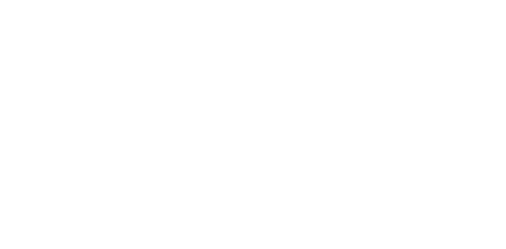
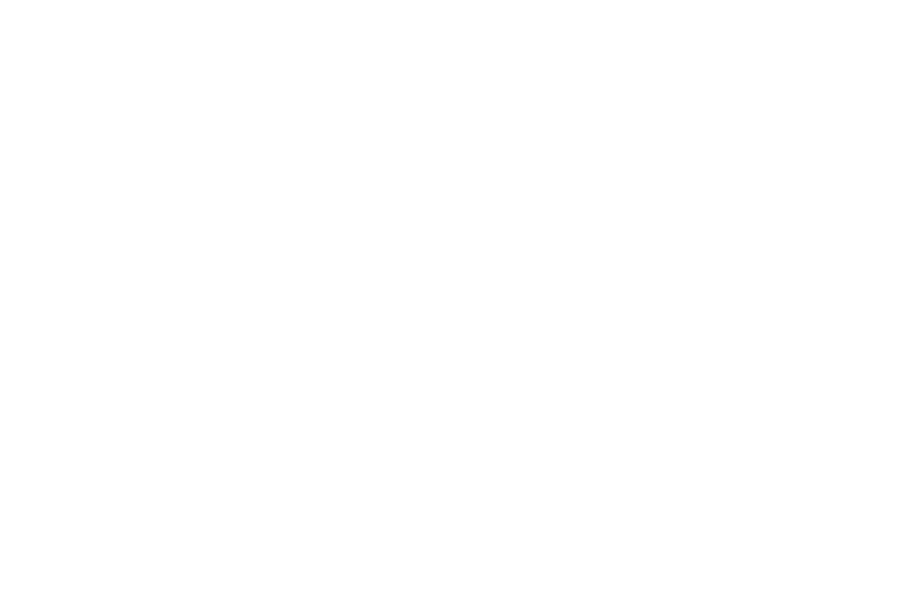
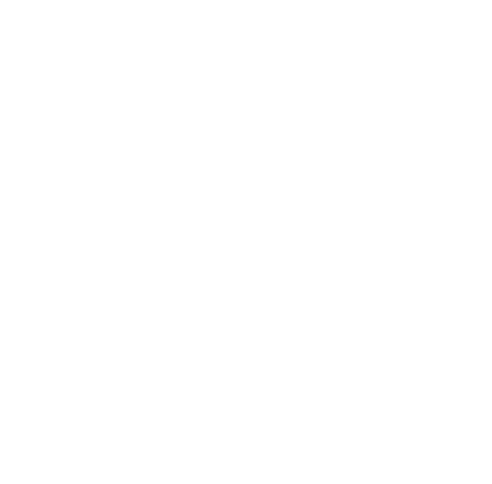
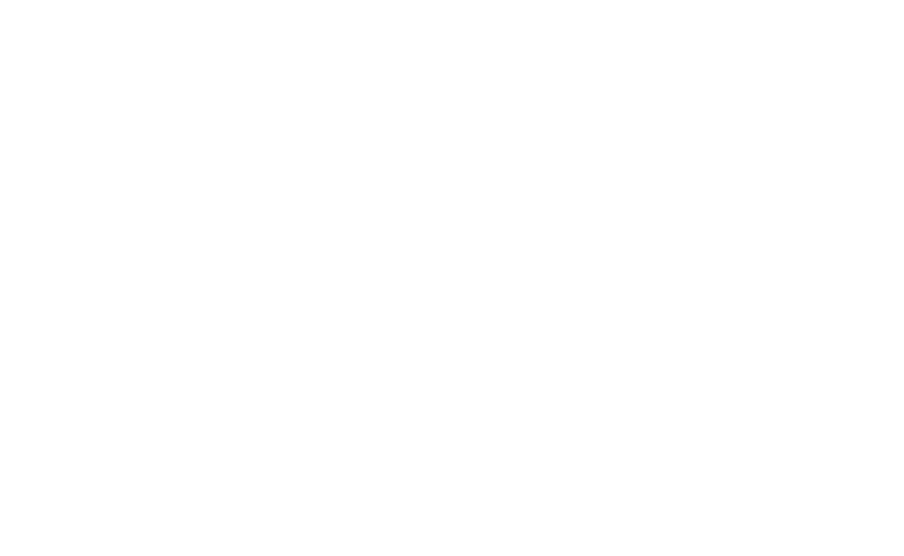

# Verilog Practice 2023

## ✅ [Lab_1 Kuznechik Cipher](https://github.com/IlyaChichkov/Verilog_Labs_2023/tree/master/Lab_1%20-%20Kuznechik%20cipher)

    </img>

Cipher class

## ✅ [Lab_2 APB Bus](https://github.com/IlyaChichkov/Verilog_Labs_2023/tree/master/Lab_2%20-%20APB)

    </img>

APB bus with testbench

## ✅ [Lab_3 GCC & GDB](https://github.com/IlyaChichkov/Verilog_Labs_2023/tree/master/Lab_3%20-%20GCC%20&%20GDB)

    </img>

Universal Makefile

## ✅ [Lab_4 Pulpino project](https://github.com/IlyaChichkov/Verilog_Labs_2023/tree/master/Lab_4%20-%20Pulpino%20project)

    </img>

Pulpino RTL and program diagrams

## ⚠️ [Final Project](https://github.com/IlyaChichkov/Verilog_Labs_2023/tree/master/Final-Project)

`Not completed yet`